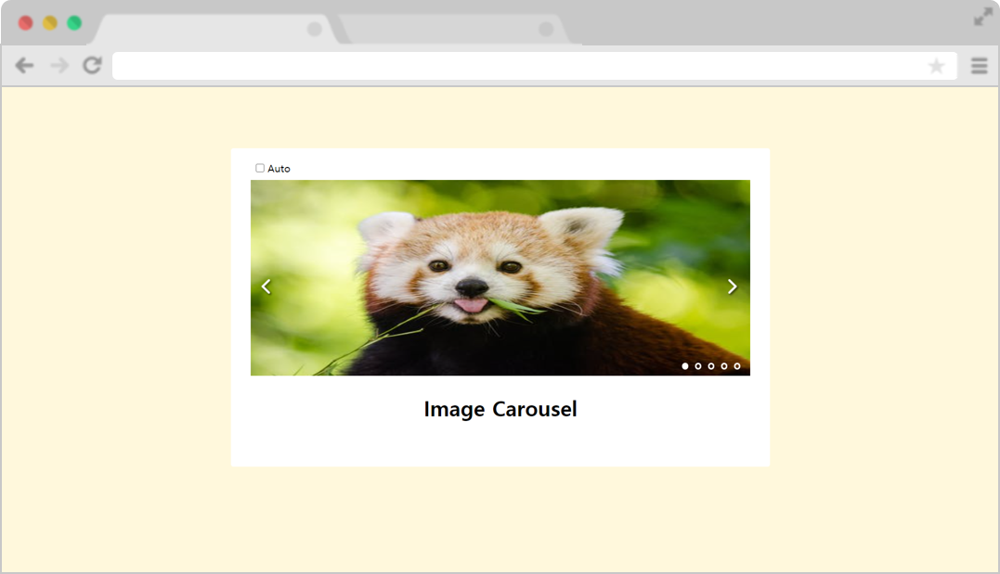

# [Vanilla JS] Carousel

[Vanilla JS 프로젝트 List](https://github.com/kei9641/projects#vanilla-js-%EB%AF%B8%EB%8B%88)

## Description

`[Vanilla JS] Carousel`은 순수 자바스크립트로 이미지 슬라이드 기능을 구현한 코드입니다. 

이 코드는 아래의 기능을 포함하고 있습니다.

- __현재 이미지 표시__ : 슬라이드 우측 하단의 원으로 현재 슬라이드가 몇번째 슬라이드인지 표시되어있습니다. 원을 클릭하면 해당 순서의 이미지로 슬라이드를 이동시킵니다.
- __좌우 슬라이드__ : 좌우 화살표를 클릭하여 이미지를 이동할 수 있습니다.
- __자동 슬라이드__ : auto 설렉트 박스를 checked 상태로 하면 3초마다 자동으로 슬라이드가 넘어갑니다.

> 기존의 슬라이더는 auto기능과 특정 페이지로 넘어가는 기능을 동시에 사용하는 경우, interval이 유지되어 특정 페이지로 넘어간 뒤 빠르게 다음 페이지로 상황이 있었습니다. 해당 프로젝트의 코드에는 사용자가 특정 페이지로 넘어간다면 auto기능을 사용하여도 interval을 reset하여 위와 같은 상황을 방지하였습니다.

## Development Environment

- HTML
- CSS
- JavaScript
- github Page
- VS Code

  

## Installation

#### For user

아래의 버튼을 통해 서비스를 이용할 수 있습니다.

## Browser Support

|  |  |  |  |  |  |  |  |
| :-----------------------------------------: | :---------------------------------: | :-------------------------------------------: | :-------------------------------------: | :--------------------------------------: | :---------------------------------------: | :----------------------------------------: | :--------------------------------------: |
|                      ✔                      |                  ❌                  |                       ✔                       |                    ✔                    |                    ✔                     |                     ✔                     |                     ✔                      |                    ✔                     |

 

## Demo

#### How to contact me

- 추가적으로 궁금한 사항이나 연락을 원하시면 kei9641@naver.com으로 메일을 보내주세요. 읽는 즉시 답장드리겠습니다.
- 더 빠른 연락이 필요하시면 [오픈카톡](https://open.kakao.com/me/here0k)으로 연락주세요.

자세한 사항은 [프로필](#)을 확인해주세요.

© 2021. 김영주 all rights reserved.

